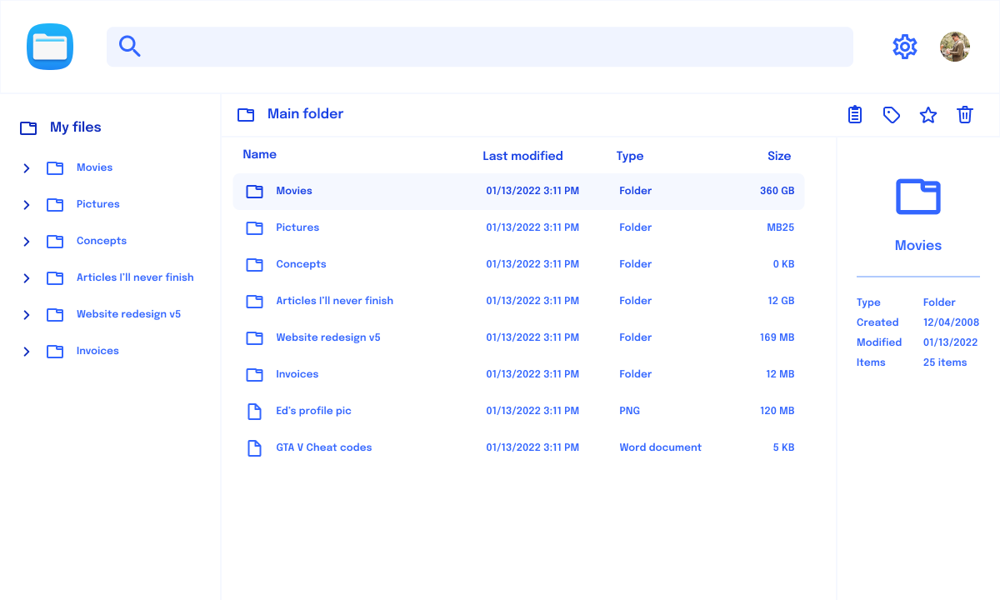
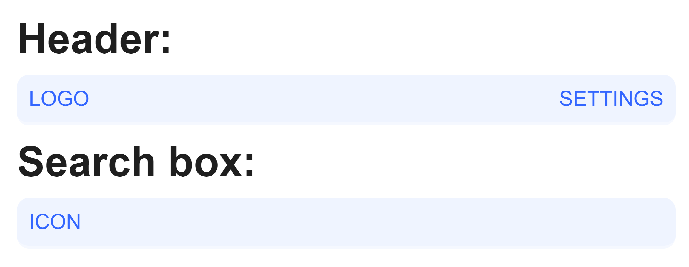

---
{
    title: "Styling",
    description: "",
    published: '2025-01-01T22:12:03.284Z',
    tags: ["react", "angular", "vue", "webdev"],
    order: 3
}
---

<details>
<summary>What tools are we learning in this chapter?</summary>
Styling is a highly contested space in web development. Surely, no matter what tools I select there will always be someone with a different perspective on which tools I should have written about.

Just to name a few, here's some of the styling tools we're not talking about in this chapter:

- [Styled Components](https://styled-components.com/)
- [StyleX](https://stylexjs.com/)
- [UnoCSS](https://unocss.dev/)
- [Vanilla Extract](vanilla-extract.style/)
- [Less](https://lesscss.org/)

Given the broad range and number of tools we aren't looking at, what tools _are_ we going to be learning about? Well, in addition to a few built-in browser techniques, we'll touch on:

- [Tailwind](https://tailwindcss.com/) for its ubiquitous adoption among utility class libraries (nearly 10M downloads a week on NPM) 
- [CSS Modules](https://github.com/css-modules/css-modules) for its close-to-bare CSS and invisible usage
- [SCSS](https://sass-lang.com/) for its broad adoption (13M downloads a week on NPM) and ability to compile complex styling to raw CSS
- [Emotion](https://emotion.sh/) for its framework agnostic approach to runtime CSS-in-JS
- [Panda CSS](https://panda-css.com/) for its framework agnostic approach to compiled away CSS-in-JS

Let's get into it.

</details>

CSS is awesome. It's also used in every web app out there; which makes sense given that it's one of the three core languages of the web: HTML, CSS, and JavaScript.

If we wanted to, for example, build the header bar of this mockup:



Our markup might look something like this:

```jsx
<header class="container">
	<LogoIcon/>
	<SearchBar/>
	<SettingsCog/>
	<ProfilePicture/>
</header>
```

With the `container` class being defined in CSS like so:

``` css
/* header.css */
.container {
    display: flex;
    padding: 8px 24px;
    align-items: center;
    gap: 32px;
    border-bottom: 2px solid #F5F8FF;
    background: #FFF;
}
```

This works out pretty well for some basic styling!


Now let's build out the search box:

```html
<div class="container">
	<SearchIcon/>
</div>
```

```css
/* search-box.css */
.container {
	border-radius: 8px;
    color: #3366FF;
    background: rgba(102, 148, 255, 0.1);
    padding: 8px;
    flex-grow: 1;
}
```


Now let's import both of these CSS files into the same HTML file:

```html
<link rel="stylesheet" href="header.css">
<link rel="stylesheet" href="search-box.css">
```

Annnnd:



Oh dear... It seems like the styling for the header has impacted the search box and vice-versa.

-----

This merging of styling is occurring because `container` is the same CSS identifier between the search box container and the header container; despite being in two different CSS files.

This problem is known as "scoping", and is a problem that gets worse the larger your codebase gets; it's hard to keep track of every preexisting class name that's been used.

# BEM Classes

One way to solve this problem of scoping in CSS relies on no external tooling than a self-motivated convention. This solution is called "BEM Classes".

BEM stands for "Box Element Modifier" and helps you establish scoping through uniquely named classes that are "namespaced" based on where on the screen they exist.

// TODO: Replace this with our own


The example we demonstrated scoping problems within has two "boxes":

1) The header
2) The search box

As such, the container for these elements might be called:

```css
.header {}

.search-box {}
```

-----

The "Elements" part of BEM is then referring to the elements within each "Box".

For example, both the header and the search box have icons inside. We would then prefix the "Box" name and then the name of the "Element":

```css
.header__icon {}

.search-box__icon {}
```

------

Finally, we have "Modifiers" to complete the "BEM" acronym.

For example, we might want to have two different colors of icons we support; sharing the rest of the styling across all header icons besides the color.

To do this, we'll prefix the name of the "Box" followed by what the "Modifier" does:

```css
.header--blue {}

.search-box--grey {}
```

------

BEM is a viable alternative for large-scale codebases if you follow its conventions well enough. Many people swear by its utility and ability to leverage the platform itself to solve the scoping problem.

However, for some, even the need to remember what "Box" names have already been used can lead to confusion and other levels of scoping problems.

Let's look at some other alternatives to using the BEM methodology.

# Utility Classes

Another way you're able to solve the problem of scoping through convention is by leaning into the shared aspects of CSS classes as styling identifiers.

// Talk about how you can build your own utility classes and avoid this scoping issue by never scoping

## Tailwind

// Then talk about the benefits of having a pre-built utility system like Tailwind avoiding retraining for folks and providing sane out-of-the-box token defaults

# CSS Modules

"But not everyone wants to use utility classes for their solutions. For many, they just want to reuse their existing CSS knowledge with the scoping problem solved for them."

// Talk about how this is built into just about everything and solves the problems with CSS scoping

# SCSS

// Talk about how adding in a compilation step into your stylesheets enables everything from CSS modules but also adds new features (tokens, etc)

// Talk about the downsides of using a new language for tokens and such

# CSS-in-JS 

// Talk about the benefits regarding typechecking, tokens, and more

// Then talk about the downsides of not working properly in SSR, SSG, or other static contexts

// Also downsides of the performance aspect

React: https://emotion.sh/docs/introduction

Also with React, talk about the `styled` API

Angular: https://stackblitz.com/edit/angular-ivy-v7vjkp?file=src%2Fapp%2Fapp.component.ts,src%2Fapp%2Fapp.component.html

Vue: https://stackblitz.com/edit/vue-ai8qpp?file=src%2FApp.vue

# Compiled CSS-in-JS

// Talk about how ASTs are able to explore your codebase pre-emtively and codegen CSS for you in a static way

React: https://panda-css.com/docs/installation/vite
Angular: https://panda-css.com/docs/installation/cli (Angular)
Vue: https://panda-css.com/docs/installation/vue